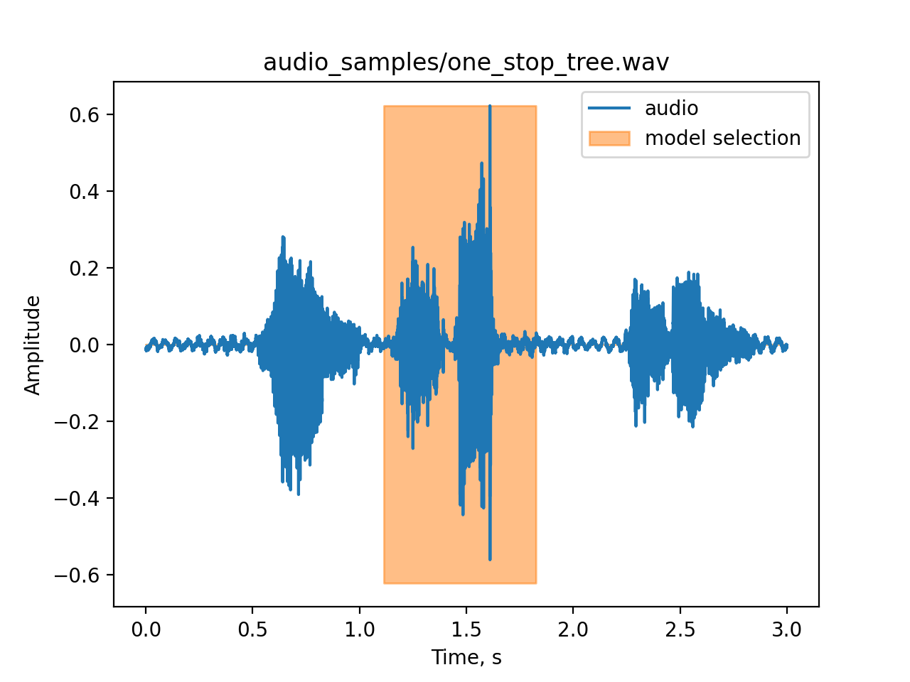
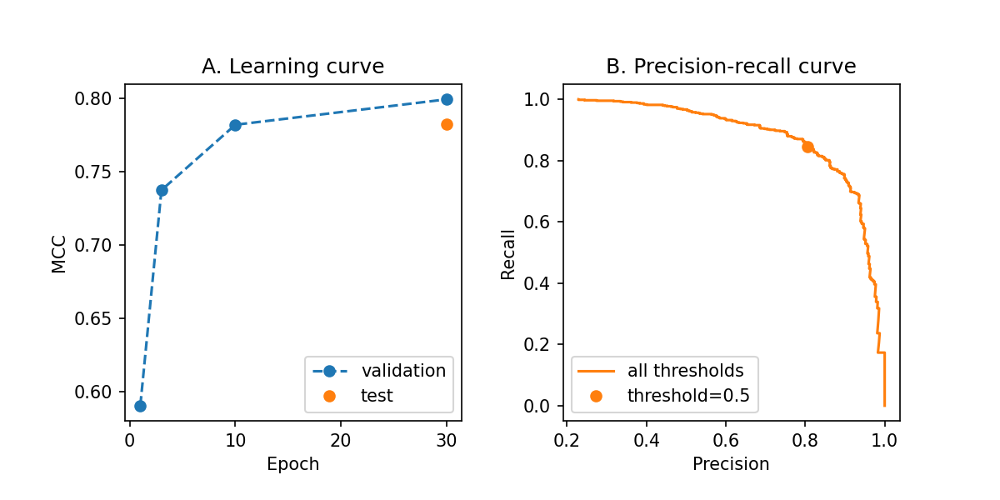

# Решение Тестового задания в отдел “Data Analytics”
Выполнил **Николай Сметанин**


## 1. Приложение для детектирования слова STOP

В качестве шаблона для детектирования было выбрано слово **STOP** в английском произношении **[stäp]**. Приложение 
реализовано на языке python. Ниже приведены инструкции по установке и использованию приложения

### 1.1. Установка
1. Установить менеджер пакетов conda, например 
   [Miniconda](https://docs.conda.io/en/latest/miniconda.html)
1. Склонировать репозиторий и перейти в корневую папку
1. Создать среду в соответствии с 
   [`environment.yml`](https://github.com/nikolaims/siemens_test_task/blob/master/environment.yml):
    ```
    conda env create -f environment.yml
    ```
1. Установить пакет 
   [`solution`](https://github.com/nikolaims/siemens_test_task/blob/master/solution):
   ```
   pip install -e .
   ```

### 1.2. Использование
Приложение поддерживает 3 разных режима работы:
1.  Декодирование из `.wav` файла и визуализация разметки аудио:
    ```
    python app.py file PATH
    ```
    В аргументе `PATH` необходимо указать путь к аудио файлу. Поддерживаются моно и стерео записи в формате `.wav`
    с произвольной частотой дискретизации. Для анализа берется только первый канал, а частота дискретизации 
    ресемплируется к 16kHz. Примеры записей находятся в 
     [`audio_samples`](https://github.com/nikolaims/siemens_test_task/blob/master/audio_samples)
    
2. Запись аудио с микрофона, с последующим декодированием и визуализацией:
   ```
   python app.py mic -r SEC
   ```
   В аргументе `SEC` необходимо указать длину записи в секундах. Запись начнется после вывода надписи *ON AIR*.
3. Декодирование и визуализация аудиопотока из микрофона в режиме реального времени:
   ```
   python app.py mic
   ```
   
### 1.3. Пример
В качестве примера приведена команда для декодирования из файла 
[`audio_samples/one_stop_three.wav`](https://github.com/nikolaims/siemens_test_task/blob/master/audio_samples/one_stop_three.wav)
в котором последовательно произносятся слова ONE, STOP, TREE:
    ```
    python app.py file audio_samples/one_stop_three.wav
    ```
Результат приведен на рис 1.:

*Fig. 1. STOP spotting on one_stop_tree.wav*
   
## 2. Методы
### 2.1. Данные
Задача, которую предлагалась решать часто обозначается как keyword spotting problem. В качестве данных для обучения 
моделей был выбран один из самых популярных датасетов для этой задачи - 
[Speech Commands Dataset](https://paperswithcode.com/dataset/speech-commands), содержащий записи набора слов, 
произнесенные разными людьми, а также записи с фоновым шумом. В качестве целевого слова было выбрано 
слово **STOP [stäp]**. Все записи из Speech Commands Dataset слова STOP были использованы и составили 20% от конечного 
датасета. Остальные слова были выбраны так, чтобы составлять 45% записей конечного датасета. Записи фонового шума без 
слов составили 35% конечного датасета. Сохраняя пропорции [слова STOP, другие слова, фон] датасет был разбит на выборки 
train, validation и test в соотношении 60%, 20% и 20% соответственно. 

### 2.2. Модель

В качестве декодирующего алгоритма была выбрана **сверточная нейронная сеть**, на вход которой подается спектрограмма 
отрезка аудиозаписи длины **1 секунда** с частотой дискретизации **16kHz**. Свертка по частотно-временному представлению
позволяет обеспечить:
 1. Обобщение относительно момента времени когда было произнесено целевое слово
 2. Обобщение относительно высоты голоса говорящего  

Реализация нейронной сети и её обучение реализовано при помощи pytorch. В качестве архитектуры сети была выбрана сеть 
с двумя сверточными слоями и одним полносвязным слоем на выходе. Архитектура модели подобна архитектуре benchmark-модели
использованной в статье с описанием [Speech Commands Dataset](https://paperswithcode.com/dataset/speech-commands). 
Главным отличием модели настоящей работы от приведенной в статье является адаптация к решению бинарной классификации 
(сегмент аудио содержит либо не содержит слово STOP) вместо классификации нескольких классов слов. Модель задана в виде 
класса, подробные параметры которой можно посмотреть в
 [`solution.model`](https://github.com/nikolaims/siemens_test_task/blob/15b5861578199a69e77839cb443f8ef20249d93a/solution/model.py#L4-L18).

### 2.3. Обучение
В качестве loss-function использовалась Binary Cross Entropy. Скрипт реализующий обучение - 
[`train.py`](https://github.com/nikolaims/siemens_test_task/blob/master/train.py). Обучение происходило эпохами по 
160 батчей состоящих из 64 семпла. 

### 2.4. Качество
Поскольку в задании не определен контекст задачи метрикой качества модели был выбран 
[Matthews correlation coefficient](https://en.wikipedia.org/wiki/Matthews_correlation_coefficient)
 как метрику общего вида применяемой для бинарной классификации на несбалансированной выборке. На картинке 2A ниже 
приведено качество модели после разного количества эпох на выборке valid и финальная метрика на test. На картинке 2B
представлена кривая precision-recall для финальной модели на тестовой выборке, в зависимосте от потребностей задачи 
может быть выбран тот или иной порог ответа сети. 


*Fig. 2. Learning (A) and precision-recall (B) curves*

